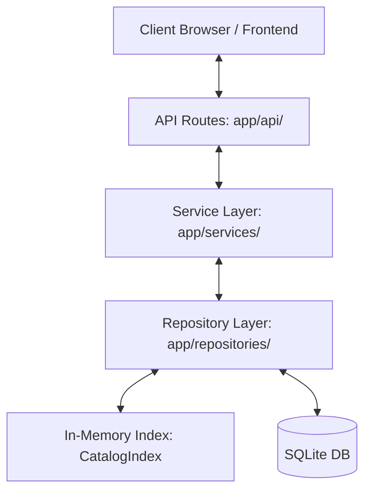

# ⚡ LibTrack

[](https://fastapi.tiangolo.com)
[](https://www.sqlalchemy.org)
[](https://www.python.org)
[](https://www.sqlite.org)

A high-performance library management REST API featuring a custom **in-memory Binary Search Tree (BST)** and **Hash Map** hybrid indexing system for fast searches and ordered range queries.

---

## 📌 Project Overview

LibTrack provides a sleek REST API for managing a library catalog, member accounts, loans, and reservations. To bridge the gap between persistence durability and search speed, LibTrack employs a dual-index architecture:
- **Database Durability**: SQLAlchemy ORM with SQLite handles transactional operations, foreign key relations, and polymorphic persistence.
- **In-Memory Cache**: A custom process-wide hybrid index (BST + Hash Map) facilitates rapid, search-efficient alphabetical indexing and title range queries.

---

## 🏗️ Architecture



### Directory Map

* **[`app/core/`](file:///c:/Users/aryan/Downloads/libtrack/app/core)** — App configuration, database engine/session setup, and JWT/bcrypt security helpers.
* **[`app/models/`](file:///c:/Users/aryan/Downloads/libtrack/app/models)** — SQLAlchemy ORM models featuring polymorphic joined-table inheritance.
* **[`app/repositories/`](file:///c:/Users/aryan/Downloads/libtrack/app/repositories)** — The boundary layer handling SQL querying and cache synchronization.
* **[`app/services/`](file:///c:/Users/aryan/Downloads/libtrack/app/services)** — Business logic services (`AuthService`, `CatalogService`, `LoanService`, `ReservationService`).
* **[`app/schemas/`](file:///c:/Users/aryan/Downloads/libtrack/app/schemas)** — Pydantic request and response schemas.
* **[`app/utils/`](file:///c:/Users/aryan/Downloads/libtrack/app/utils)** — Implementations of `TitleBST` and `CatalogIndex`.

---

## ⚡ Hybrid Indexing Strategy

To resolve the trade-offs of single-structure caches, LibTrack implements a dual-index schema inside [`CatalogIndex`](file:///c:/Users/aryan/Downloads/libtrack/app/utils/search_structures.py):

| Need | Cache Data Structure | Complexity (Avg) | Why? |
| :--- | :--- | :--- | :--- |
| **Lookup by ID / ISBN** | Python `dict` (Hash Map) | $O(1)$ | Direct, constant-time exact lookups. |
| **Exact Title Search** | `TitleBST` | $O(\log n)$ | Fast lookup with natural string sorting. |
| **Alphabetical Listing** | `TitleBST` | $O(n)$ | Retrieved via in-order traversal without sorting overhead. |
| **Range Query (A–M)** | `TitleBST` | $O(\log n + k)$ | Traversing nodes matching bounds in logarithmic time. |

> [!TIP]
> Standard python hash-maps (`dict`) do not preserve keys in a sorted sequence. Fetching elements alphabetically requires sorting the collection on every query ($O(n \log n)$). The BST keeps titles ordered on insertion, offering highly performant range and alphabetical walks.

---

## 🛠️ Installation & Setup

### 1. Local Setup
```bash
# Clone the repository
git clone <repo-url>
cd libtrack

# Create and activate a virtual environment
python -m venv .venv
# Windows:
.venv\Scripts\activate
# macOS/Linux:
source .venv/bin/activate

# Install requirements
pip install -r requirements.txt

# Run migrations to initialize the SQLite database
alembic upgrade head

# Launch the FastAPI dev server
uvicorn app.main:app --reload
```

> [!NOTE]
> The interactive documentation will be available at [http://localhost:8000/docs](http://localhost:8000/docs).

### 2. Docker Setup
```bash
docker compose up --build
```

This commands builds the image, performs database migrations inside the container, and serves uvicorn on port `8000`.

---

## 🧪 Testing

```bash
pytest -v
```
Tests leverage an in-memory SQLite database (`StaticPool`) to ensure each test case starts with a fresh database schema. The in-memory cache index is automatically cleared between tests to prevent state leakage.

---

## 📞 API Endpoints

### 🔐 Authentication
* `POST` `/api/v1/auth/register` — Register a new member.
* `POST` `/api/v1/auth/login` — Log in and retrieve a JWT bearer token.

### 📚 Catalog Management
* `POST` `/api/v1/items/books` *(Admin)* — Add a physical book.
* `POST` `/api/v1/items/ebooks` *(Admin)* — Add a digital e-book.
* `POST` `/api/v1/items/journals` *(Admin)* — Add a serial journal.
* `GET` `/api/v1/items/search` — Search catalog (Exact BST or substring database search).
* `GET` `/api/v1/items/alphabetical` — Retrieve the full catalog ordered alphabetically.
* `GET` `/api/v1/items/range` — Perform a range search on titles (e.g. `start=A&end=M`).
* `GET` `/api/v1/items/{id}` — Get detailed specifications of an item.

### 💳 Loans & Checkout
* `POST` `/api/v1/loans/checkout/{item_id}` *(Member)* — Checkout a library item.
* `POST` `/api/v1/loans/{loan_id}/return` *(Member)* — Return an item and evaluate overdue fines.
* `GET` `/api/v1/loans/my` *(Member)* — View active and past loans of the current member.
* `GET` `/api/v1/loans/overdue` *(Admin)* — Fetch all overdue loans in the system.

### ⏳ Reservations
* `POST` `/api/v1/reservations/{item_id}` *(Member)* — Reserve a copy when none are available.
* `POST` `/api/v1/reservations/{id}/cancel` *(Member)* — Cancel a pending reservation.

---

## 💡 System Design Decisions

### Joined-Table Polymorphic Inheritance
The catalog uses a polymorphic model hierarchy via **Joined-Table Inheritance**. The parent database table (`items`) contains mutual columns (`title`, `author`, `isbn`, `available_copies`). Separate child tables (`books`, `ebooks`, and `journals`) reference this row through foreign keys, fetching specialized attributes (such as `download_url` or `issue_number`) polymorphically.

### Checkout & Loan Policies
- **Concurrency Limit**: Members can only hold **one active loan** of any specific item at a time.
- **Copy Controls**: When an item's `available_copies` is `0`, further loans are rejected with a `409 Conflict`.
- **Loan Duration**: Defaults to **14 days** (customizable via `LOAN_PERIOD_DAYS` in `config.py`).

### Lazy Fine Calculation
Overdue fines are not updated continuously in the database. Instead, they are calculated lazily **at return time**:
$$\text{fine\_amount} = \max(0, \text{days\_overdue}) \times \text{FINE\_PER\_DAY}$$
The default fine rate is **$0.50** per day.

### Automated Queue Promotion
When a copy is returned, the reservation queue is evaluated:
1. The earliest reservation marked as `WAITING` (ordered by `queue_position`) is identified.
2. Its status is updated to `READY`, allocating the copy to that member.
3. Cancellations set status to `CANCELLED` without changing queue numbers of other members to prevent write locks, preserving relative ordering efficiently.
