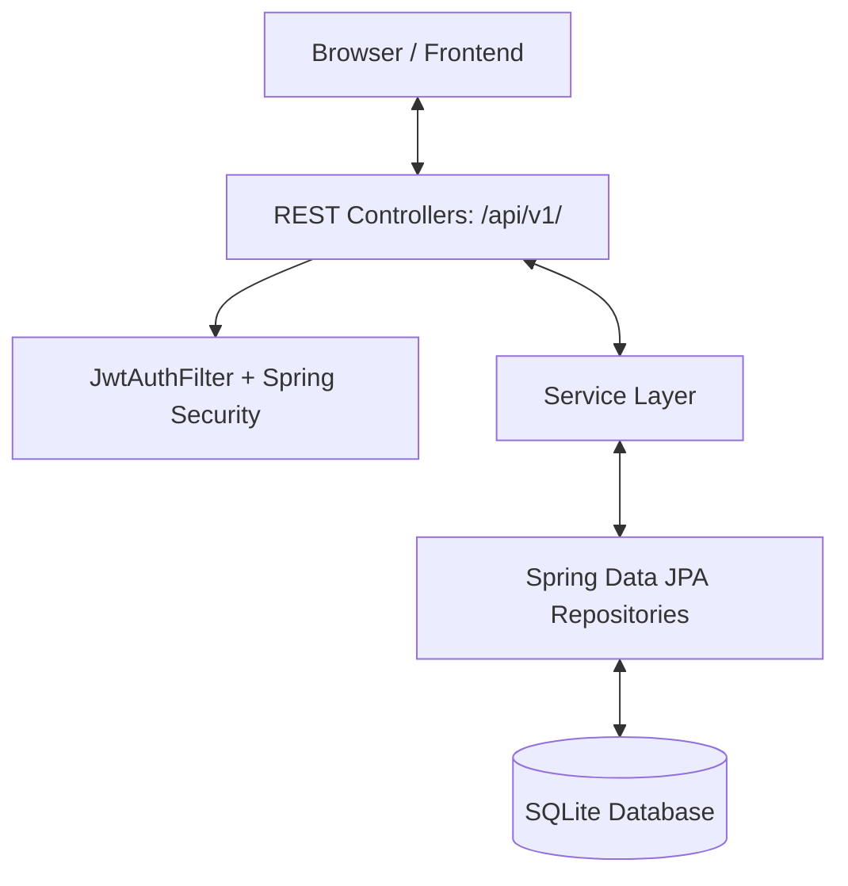

# ⚡ LibTrack

[](https://spring.io/projects/spring-boot)
[](https://openjdk.org)
[](https://spring.io/projects/spring-security)
[](https://maven.apache.org)
[](https://www.sqlite.org)

A full-featured **Library Management System** REST API built with **Spring Boot 3.3** and **Java 21**. Features JWT-based authentication, role-based access control, polymorphic catalog item types, loan tracking with overdue fine calculation, and a FIFO reservation queue system.

---

## 📌 Project Overview

LibTrack provides a complete REST API for managing:

- 👤 **Members** — Registration, login with JWT tokens, admin & member roles
- 📚 **Catalog** — Books, EBooks, and Journals via polymorphic JPA inheritance
- 💳 **Loans** — Checkout / return workflow with automatic overdue fine calculation
- ⏳ **Reservations** — FIFO queue with automatic promotion when copies become available

---

## 🏗️ Architecture



### Backend Structure (`backend/src/main/java/com/libtrack/`)

| Package | Responsibility |
|---|---|
| `config/` | CORS (`AppConfig`), Spring Security (`SecurityConfig`), JWT properties |
| `security/` | `JwtUtil` — token generation/validation · `JwtAuthFilter` — Bearer token extraction |
| `model/` | JPA entities: `Member`, `LibraryItem` *(base)*, `Book`, `EBook`, `Journal`, `Loan`, `Reservation` |
| `dto/` | Request & response objects for auth, items, loans, reservations |
| `repository/` | Spring Data JPA interfaces with JPQL queries |
| `service/` | Business logic: `AuthService`, `CatalogService`, `LoanService`, `ReservationService` |
| `controller/` | REST controllers + `GlobalExceptionHandler` |

---

## 🛠️ Prerequisites

- **Java 21+** — [Download Temurin](https://adoptium.net/)
- **Maven 3.8+** — [Download Maven](https://maven.apache.org/download.cgi)

---

## 🚀 Installation & Setup

### 1. Local Setup

```bash
# Clone the repository
git clone https://github.com/aryanmish96-cloud/LibTrack-Library-Management-System-.git
cd LibTrack-Library-Management-System-

# Build the project (skip tests for a quick start)
cd backend
mvn clean package -DskipTests

# Run the server from the project root
# (so the SQLite DB resolves to ../libtrack.db)
cd ..
java -jar backend/target/libtrack-1.0.0.jar
```

The API will be live at **http://localhost:8000/api/v1**

Then open `frontend/index.html` in your browser to use the full UI.

> [!NOTE]
> The server auto-creates all database tables on first run via `spring.jpa.hibernate.ddl-auto=update`. No manual migration step needed.

### 2. Docker Setup

```bash
docker compose up --build
```

Builds a multi-stage image (Maven build → slim JRE runtime) and serves the API on port `8000`.

---

## 🧪 Testing

```bash
cd backend
mvn test
```

---

## 📞 API Reference

Base URL: `http://localhost:8000/api/v1`

All protected endpoints require: `Authorization: Bearer <token>`

### 🔐 Authentication

| Method | Endpoint | Auth | Description |
|--------|----------|------|-------------|
| `POST` | `/auth/register` | Public | Register a new member |
| `POST` | `/auth/login` | Public | Login → returns `{ access_token, token_type }` |

### 📚 Catalog

| Method | Endpoint | Auth | Description |
|--------|----------|------|-------------|
| `POST` | `/items/books` | Admin | Add a physical book |
| `POST` | `/items/ebooks` | Admin | Add a digital e-book |
| `POST` | `/items/journals` | Admin | Add a serial journal |
| `GET` | `/items/search?title=&exact=` | Public | Search catalog by title |
| `GET` | `/items/alphabetical` | Public | Full catalog, sorted A–Z |
| `GET` | `/items/range?start=&end=` | Public | Items with titles in a letter range |
| `GET` | `/items/{id}` | Public | Get a single item by ID |

### 💳 Loans

| Method | Endpoint | Auth | Description |
|--------|----------|------|-------------|
| `POST` | `/loans/checkout/{item_id}` | Member | Check out an item |
| `POST` | `/loans/{loan_id}/return` | Member | Return an item (calculates fine) |
| `GET` | `/loans/my` | Member | All loans for the current member |
| `GET` | `/loans/overdue` | Admin | All overdue loans system-wide |

### ⏳ Reservations

| Method | Endpoint | Auth | Description |
|--------|----------|------|-------------|
| `GET` | `/reservations/my` | Member | Current member's reservations |
| `POST` | `/reservations/{item_id}` | Member | Place a reservation (returns queue position) |
| `POST` | `/reservations/{id}/cancel` | Member | Cancel a pending reservation |

---

## 💡 Design Decisions

### Polymorphic Catalog — JPA JOINED Inheritance

Items use `@Inheritance(strategy = InheritanceType.JOINED)` with a `item_type` discriminator column. The parent `items` table holds shared fields (`title`, `author`, `isbn`, `available_copies`). Child tables (`books`, `ebooks`, `journals`) extend it with type-specific fields.

### Stateless JWT Security

Login issues an **HS256 JWT** with `{ sub: memberId, role: "admin"|"member", exp }`. A `JwtAuthFilter` validates every request and populates the Spring Security context — no sessions, no state.

### Checkout & Loan Policies

- A member may only hold **one active loan** per item at a time (returns `409 Conflict` otherwise)
- Checkout is blocked when `available_copies = 0` (`409 Conflict`)
- Default loan period: **14 days** (configurable via `loan.period-days` in `application.properties`)

### Lazy Fine Calculation

Fines are computed at **return time**, not continuously:

```
fine = max(0, days_overdue) × fine_per_day
```

Default rate: **$0.50 / day** (configurable via `loan.fine-per-day`)

### Automated Queue Promotion

When an item is returned, the service automatically promotes the earliest `WAITING` reservation to `READY` status, so that member knows their copy is available to collect.

---

## ⚙️ Configuration

Edit `backend/src/main/resources/application.properties`:

| Property | Default | Description |
|---|---|---|
| `server.port` | `8000` | HTTP port |
| `spring.datasource.url` | `jdbc:sqlite:../libtrack.db` | SQLite database path |
| `jwt.secret` | *(change in prod)* | HMAC-SHA256 signing key |
| `jwt.expiration-ms` | `86400000` | Token lifetime (24 h) |
| `loan.period-days` | `14` | Default checkout duration |
| `loan.fine-per-day` | `0.50` | Overdue fine rate (USD) |
